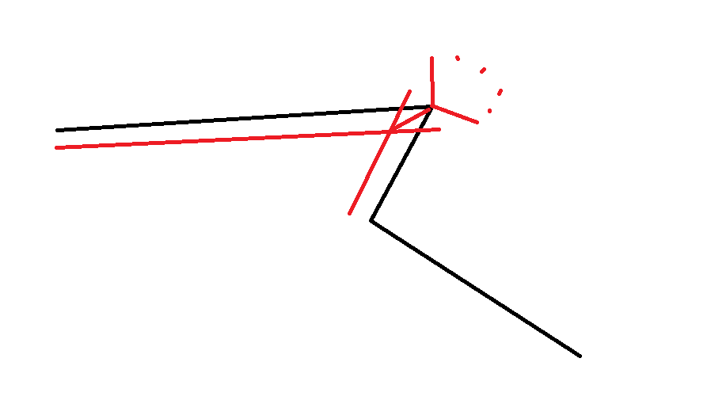

### 模块

#### mainWindow

窗口

选择绘制方式、颜色、大小

#### Canvas

画布

处理绘制、点击事件，管理几何图形

#### Geo

几何图形类

管理自己的点、颜色、怎么绘制

处理点击之类的事件来更新图形

#### mathUtil

用来计算获得需要的图形的轮廓等

#### DrawSettings

绘制设置

主要是mainWindow的关于绘制的设置不方便传递。

直接全局保存获得。

（对于某个图形的怎么调整？？？）

（可以试试，把选中图形放到一起，获得选中时设置）

### 缓冲区分析

1.直接画很多圆和矩形无边框覆盖成缓冲区

复杂度*=画圆,且不能画出外轮廓。

2.画出外轮廓填充。

一般情况，计算锐角里的一个交点，钝角中的圆弧

