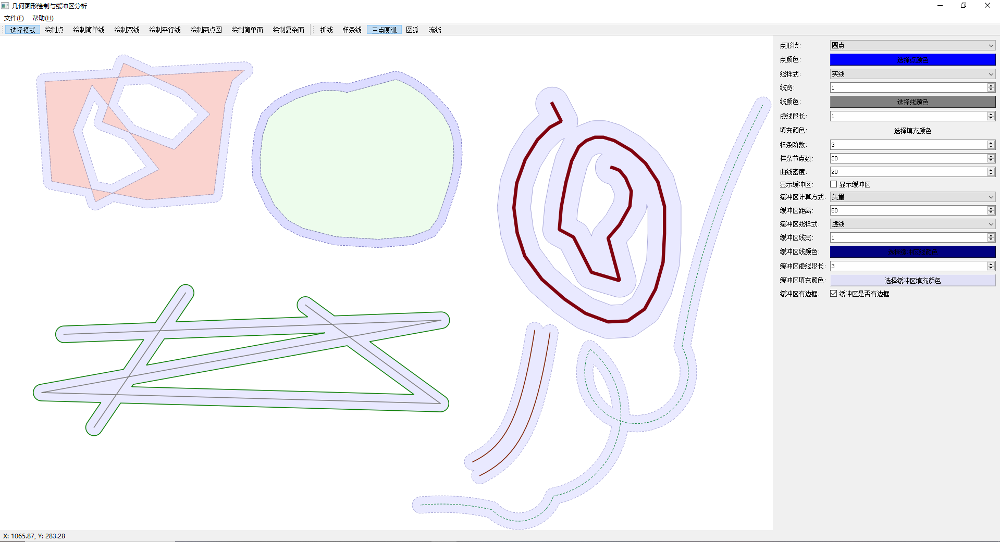
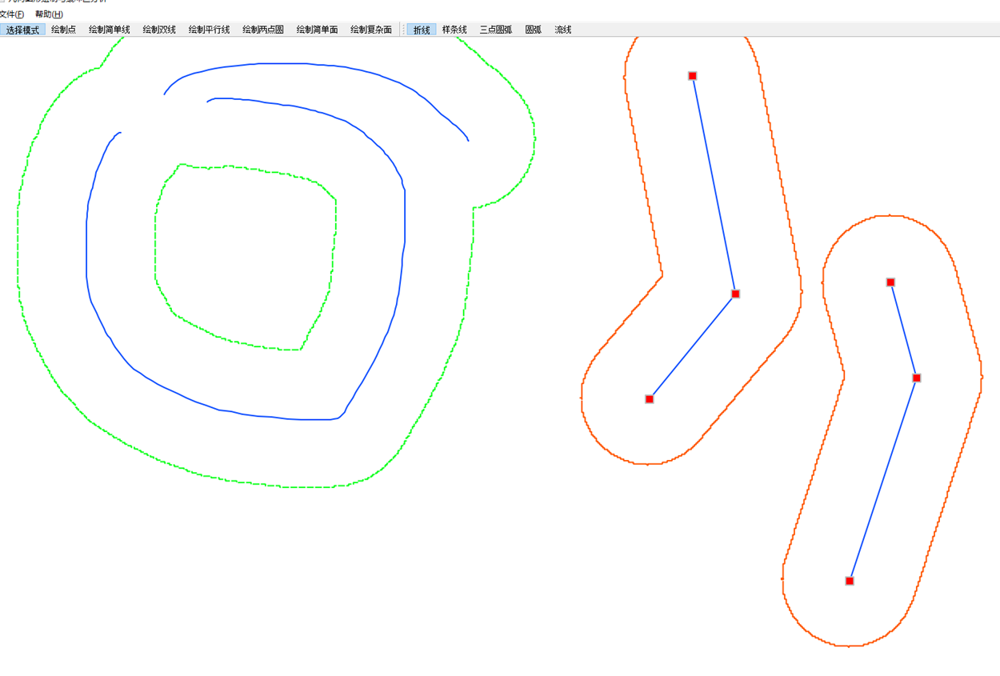

| **模块**             | **功能**                                                     |
| :------------------- | ------------------------------------------------------------ |
| **comm**             | 关于中文显示的宏、简单日志的定义和宏、全局变量。             |
| **Enums**            | 定义项目中使用的枚举类型。                                   |
| **Geo**              | 定义几何基类和它派生的各种图形、点、线、面。                 |
| **GeoMathUtil**      | 提供几何和数学计算相关的工具函数，通过控制点辅助Geo绘制图形。 |
| **MainWindow**       | 负责主界面的显示和管理，处理用户界面的交互事件               |
| **PolygonBuffer**    | 处理与多边形相关的缓冲区，涉及图形绘制、空间分析等，生成多边形边界的扩展区域（缓冲区）。 |
| **ShapefileManager** | 管理 Shapefile 格式数据，广泛应用于地理信息系统（GIS），包括读取、写入、解析 Shapefile 文件及空间数据处理。 |

#### 环境 vs2019 + qt5 + GDAL(用于读写shp文件)

### 项目功能：

#### 1.绘制基本图形

自定义数据结构，显示几何图形：点、简单线、双线、平行线、简单面、复杂面

1)点:支持颜色，方形，圆形 调整；

2)简单线、双线、平行线：支持颜色、节点线型（折线，样条线，三点圆弧，两点圆弧、流线）、线宽、线型（实线、虚线（如：1.0*1.0、3.0*1.0））

3)简单面、复杂面：支持颜色、节点线型（同上）、线型（同上）、面内颜色填充等

#### 2.支持修改、删除（不支持撤销）、拖拽、修改控制点、放大缩小视图

#### 3.缓冲区分析

### 技术亮点

1. **灵活的图形绘制与控制**：支持点、线、面等多种几何图形的绘制，并提供了丰富的控制选项，如颜色、线型、填充等多种样式设置。
2. **空间分析功能**：通过缓冲区分析模块，支持图形扩展区域的生成与处理，广泛应用于空间分析与地理信息系统（GIS）中。
3. **高效的界面交互**：项目的主界面通过精心设计的 UI 提供友好的操作体验，用户能够轻松管理和操作图形，满足实际需求。

#### 困难点

1.结构设计

要能画各种图形和线形，还要数据能够保存

最后经过多次修改尝试，采用了基类维护控制点，子类只负责特定控制点的操作规则、计算模块通过控制点和相关描述计算出图像，这个结构效果良好。

2.缓冲区

缓冲区计算是GIS中的一个问题

参考了相关论文，尝试过使用平行线矢量绘制、栅格法绘制

平行线绘制有自相交问题。

栅格法（矢量图映射到二维网格，遍历每个格子到所有图形上点的距离）有精度和计算量大的问题

因为栅格法的计算量实在太大（复杂度O(n3)到O(n4)之间，n是二维网格边长）,绘制结果不理想，最后还是选择平行线的矢量绘制

栅格画的结果：

矢量用平行线绘制也遇到很多难题

[矢量缓冲区自相交问题](矢量缓冲区自相交问题.md)
