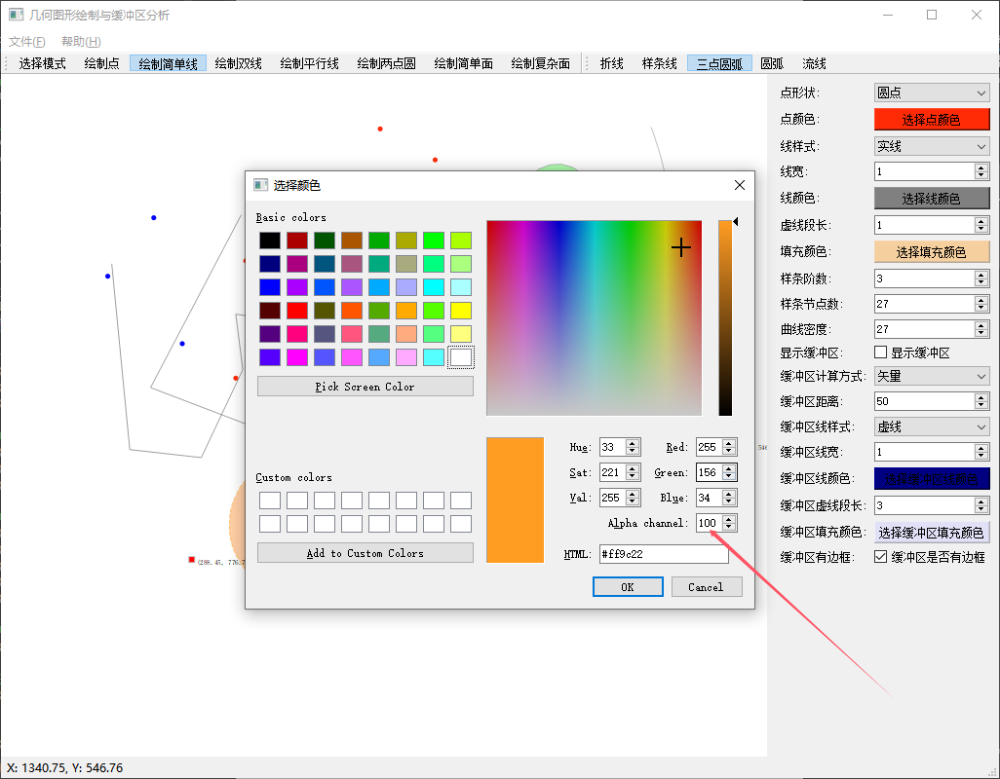

| **模块**             | **功能**                                                     |
| :------------------- | ------------------------------------------------------------ |
| **comm**             | 关于中文显示的宏、简单日志的定义和宏、全局变量。             |
| **Enums**            | 定义项目中使用的枚举类型。                                   |
| **Geo**              | 定义几何基类和它派生的各种图形、点、线、面。                 |
| **GeoMathUtil**      | 提供几何和数学计算相关的工具函数，通过控制点辅助Geo绘制图形。 |
| **MainWindow**       | 负责主界面的显示和管理，处理用户界面的交互事件               |
| **PolygonBuffer**    | 处理与多边形相关的缓冲区，涉及图形绘制、空间分析等，生成多边形边界的扩展区域（缓冲区）。 |
| **ShapefileManager** | 管理 Shapefile 格式数据，广泛应用于地理信息系统（GIS），包括读取、写入、解析 Shapefile 文件及空间数据处理。 |

#### 环境 vs2019 + qt5 + GDAL(用于读写shp文件/默认去掉了)

### 项目功能：

#### 1.绘制基本图形

自定义数据结构，显示几何图形：点、简单线、双线、平行线、简单面、复杂面

1)点:支持颜色，方形，圆形 调整；

2)简单线、双线、平行线：支持颜色、节点线型（折线，样条线，三点圆弧，两点圆弧、流线）、线宽、线型（实线、虚线（如：1.0*1.0、3.0*1.0））

3)简单面、复杂面：支持颜色、节点线型（同上）、线型（同上）、面内颜色填充等

#### 2.支持修改、删除（不支持撤销）、拖拽、修改控制点、放大缩小视图

#### 3.缓冲区分析

## 填充颜色默认是透明，这里设置透明度

