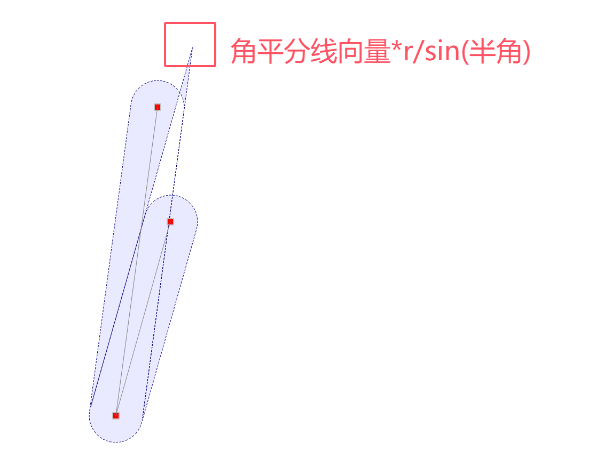

没有把直线密集求的情况：

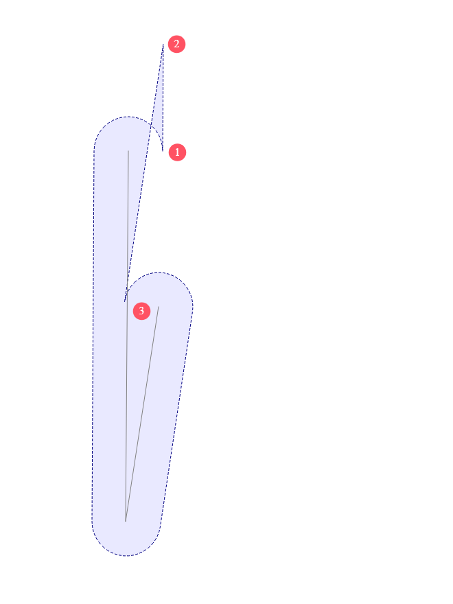


问题：这种情况出现是因为没有考虑线段长度与相连线段缓冲区交点的关系

理想情况：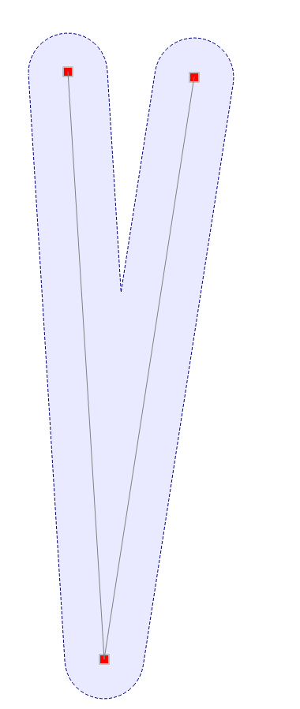

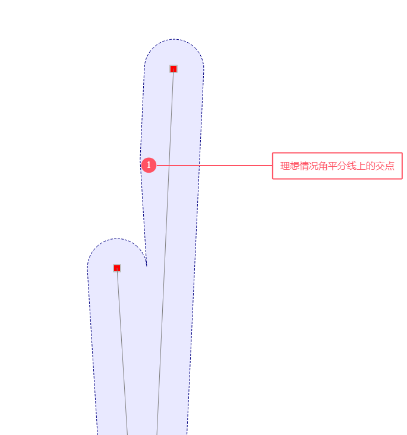

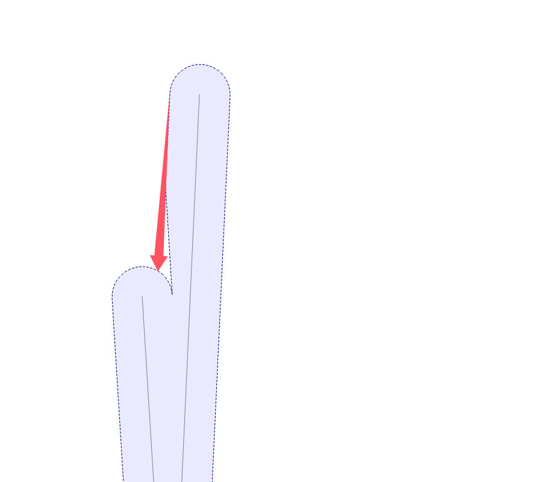

理想下的折线之间缓冲区交点在能被两条缓冲区覆盖

**是不是可以考虑做直线找出相交位置作为交点。**

是不是其实缓冲区是所有线段缓冲区的融合！

就是和QPainterPath::united()一样的运算。

```cpp
(1) 路径分割与采样
    首先，将每个路径表示为一组边界曲线（线段或曲线，如贝塞尔曲线）。
    将复杂的路径分割为简单的几何元素（如直线段或小段曲线）。
    通过离散化处理，将路径转化为顶点和边的形式。

(2) 边界检测与交点计算
    计算两个路径的所有边界交点。
    将路径在交点处分割，确保路径被切割为没有交点的子路径。
    使用高效的交点检测算法，例如 扫线算法 (Sweep Line Algorithm)，以避免暴力遍历。

(3) 构建事件表
    将所有路径的顶点和交点存入事件表（Event Table），每个事件记录路径的开始、结束和交点。
    根据事件的顺序（通常按 x 坐标排序）处理路径。

(4) 拓扑关系重建
    判断路径区域是“内”还是“外”，通常使用奇偶规则（Even-Odd Rule）或非零环绕规则（Non-Zero Winding Rule）。
    按照规则将区域划分为外部路径（Outer Contour）和孔洞路径（Inner Contour）。
    重建路径的拓扑结构，生成新的联合路径。

(5) 结果路径合成
    合并有效的子路径并移除冗余的顶点或边，最终生成一个新的 QPainterPath。
```

path也很慢

可能是因为我每个线段都加一个点，是不是其实可以优化一下，问题是角平分线的交点引起的，先判断，把直线分割


然后再融合

path的融合就是很慢(可能是点多)。


重新写分割方法交点个数减少很多

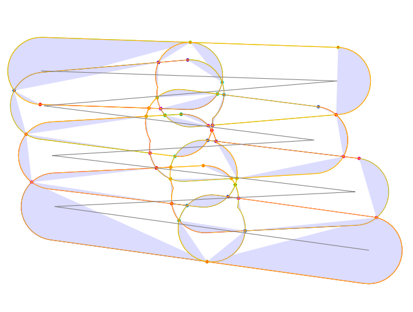

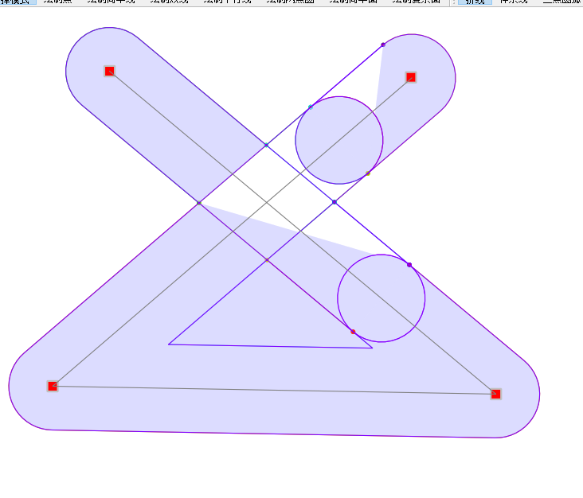

打印出裁剪线段


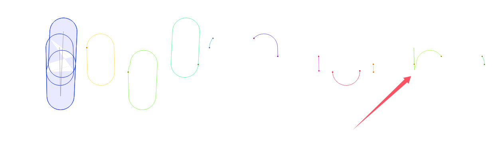

```cpp
if (splitLines.last().size() == 2 && QPointFEqual()(splitLines.last()[0], splitLines.last()[1]))
{
    splitLines.pop_back();
}
```

这个bug是刚刚去掉点照成的，主要不是这个呜呜呜。


##### 交点没有分割线

这个交点好像没算出来，或者没分割开

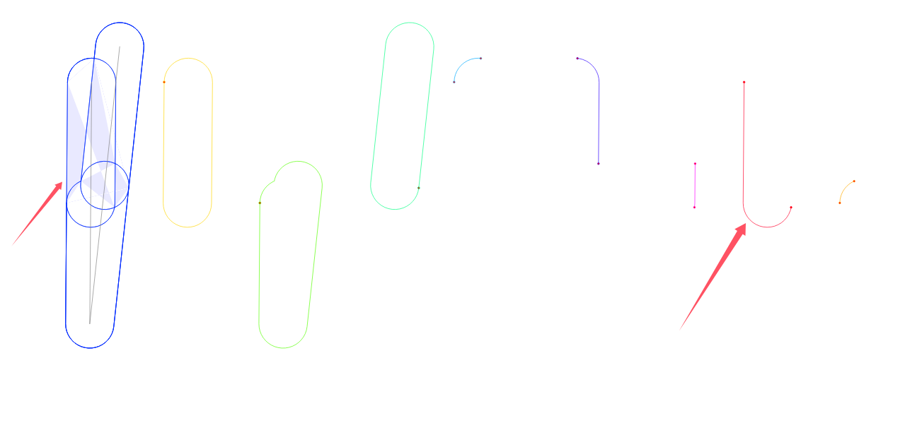

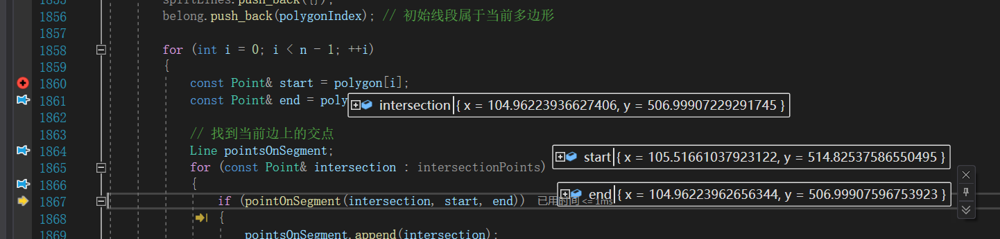

因为画图的时候是半圆当起点的位置画的，而线的分割方式决定他们在这里相交。。。

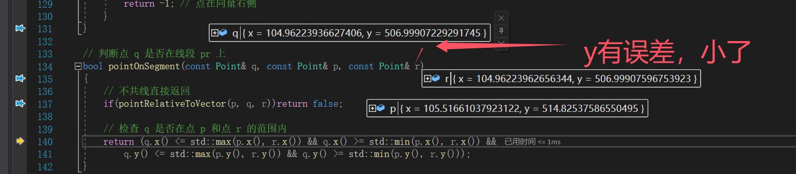

因为判断在线段上的时候，端点有误差没处理：

```cpp
// 判断点与向量的位置关系
int pointRelativeToVector(const Point& point, const Point& vectorStart, const Point& vectorEnd)
{
    // 计算向量 AB 和 AP 的叉积
    double crossProduct = cross(vectorEnd.x() - vectorStart.x(),
        vectorEnd.y() - vectorStart.y(),
        point.x() - vectorStart.x(),
        point.y() - vectorStart.y());

    // 根据叉积判断位置关系
    if (std::fabs(crossProduct) < EPSILON) {
        return 0; // 点在向量上
    }
    else if (crossProduct > 0) {
        return 1; // 点在向量左侧
    }
    else {
        return -1; // 点在向量右侧
    }
}

// 判断点 q 是否在线段 pr 上
bool pointOnSegment(const Point& q, const Point& p, const Point& r)
{
    // 不共线直接返回
    if(pointRelativeToVector(p, q, r))return false; 

    // 检查 q 是否在点 p 和点 r 的范围内
    return (q.x() <= std::max(p.x(), r.x() + EPSILON) && q.x() >= std::min(p.x(), r.x() - EPSILON) &&
        q.y() <= std::max(p.y(), r.y() + EPSILON) && q.y() >= std::min(p.y(), r.y()) - EPSILON);
}

```


##### 边上的弧被错筛选掉

还是筛选后多筛掉了边

有部分是重复点的原因，在弧线上选一个点是否在几乎图形内时选到了顶点，顶点是交点，交在另一个图形上，边界精度让他可能误判。

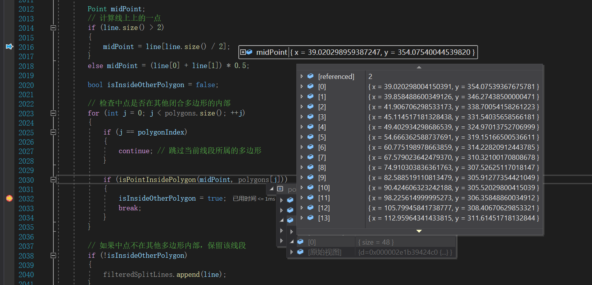

修改边框上的不处理：

```cpp
// 点是否在面内
bool isPointInsidePolygon(const Point& point, const Polygon& polygon)
{
    for (const auto& ring : polygon) // 遍历每一个闭合环（外环或内环）
    {
        int windingNumber = 0; // 用于统计点的绕数，判断是否在多边形内

        for (int i = 0; i < ring.size(); ++i)
        {
            Point p1 = ring[i];
            Point p2 = ring[(i + 1) % ring.size()]; // 下一条边

            // 判断点是否在边框上
            if (pointOnSegment(point, p1, p2))
            {
                return false;
            }

            // 判断点在边的上下关系
            if (p1.y() <= point.y())
            {
                if (p2.y() > point.y() && cross(p1 - point, p2 - point) > 0)
                {
                    ++windingNumber; // 点从下向上穿过多边形边
                }
            }
            else
            {
                if (p2.y() <= point.y() && cross(p1 - point, p2 - point) < 0)
                {
                    --windingNumber; // 点从上向下穿过多边形边
                }
            }
        }

        // 如果绕数不为 0，说明点在多边形内
        if (windingNumber != 0)
        {
            return true;
        }
    }

    return false; // 点不在多边形内
}
```

最好还是处理重复点。应该是分割的时候照成的。


##### 拆分的顺序问题

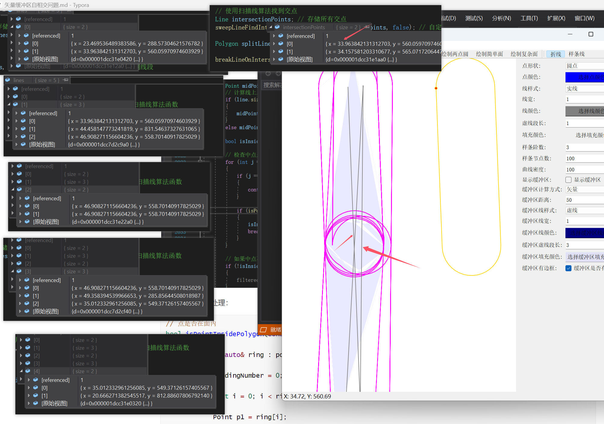

因夹角过小裁一半时，两边都一半，会有一个重复点的段（可以裁了后更新前一个点）

相邻两条线在扫描线中又产生了一个交点。（应该不能避免，就像半圆处是两个曲线的交点刚好在顶点上，应该没影响，看看分割线的时候怎么去掉端点的且前面只有一个的单点）（也能看出来不是所有的都有交点，应该还有扫描线还有精度问题）


分割后的线：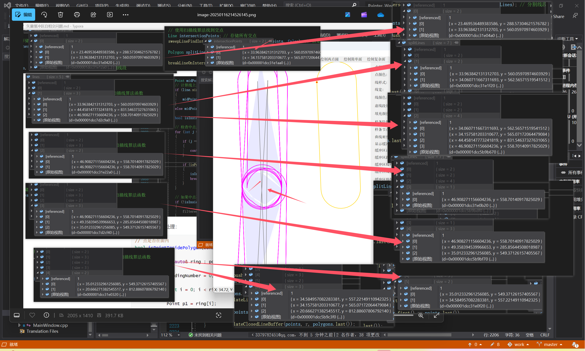


第二个接近圆，第三个就画失真了

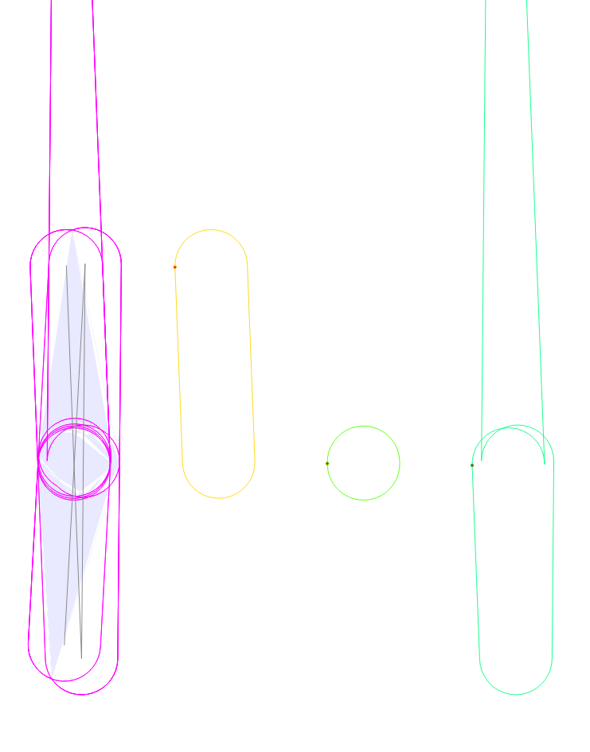

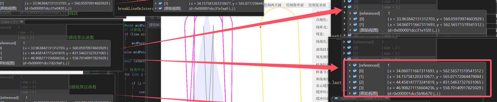

原来是角小的分割下来成三点折线处理的策略放在前面而后面扫描线找交点分割会让三线段成四线段。

就换他们的顺序就好:

```cpp
   // 自相交在前面在生成缓冲区前判断
    // Step 0: 处理自相交线,夹角小的线的打断分割

    // 三维,点组成线,多线组成面（正负缓冲区），多面
    Polygons polygons;


    // 使用扫描线算法找到交点
    Line intersectionPoints; // 存储所有交点
    sweepLineFindIntersections(pointss, intersectionPoints, false); // 自定义扫描线算法函数

    Polygon splitLines;
    breakLineOnIntersections(pointss, intersectionPoints, splitLines); // 分割线段

    Polygon splitLines2;
    breakLineOnLen(splitLines, r, splitLines2);

    for (auto& points : splitLines2)
    {
        polygons.push_back({});
        if (points.size() == 3)
        {
            polygons.last().push_back({});
            calculateLittleLineBuffer(points, r, polygons.last().last());
        }
        else if (points.first() == points.last())
        {
            calculateClosedLineBuffer(points, r, polygons.last());
        }
        else
        {
            polygons.last().push_back({});
            calculateLineBuffer(points, r, polygons.last().last());
        }
    }
```


##### 错误过滤（未解决）

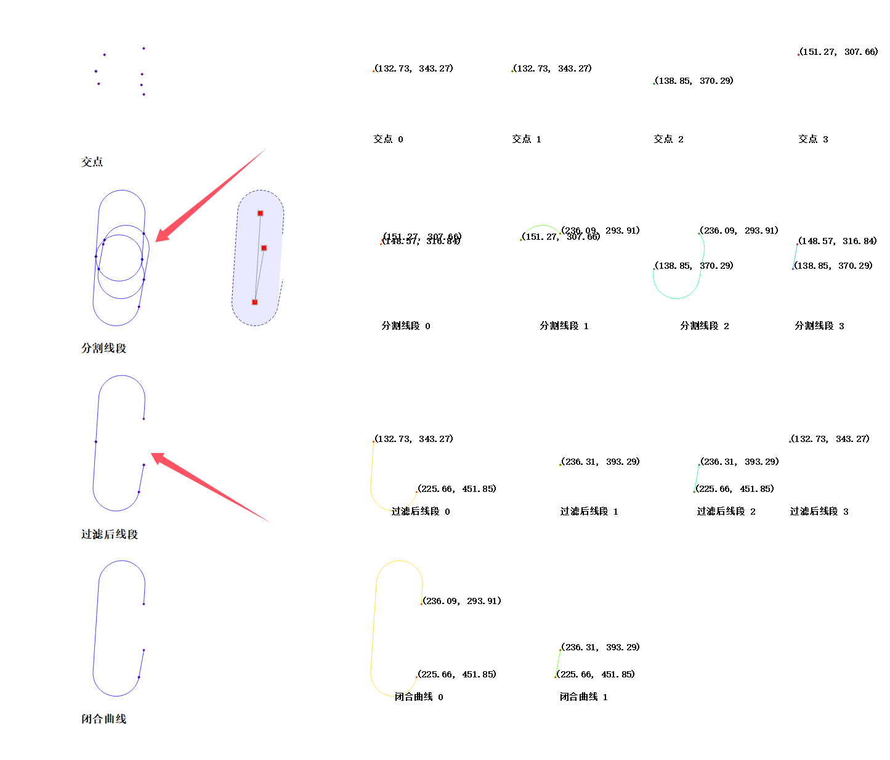


##### 明明可以构成功，但是没成功

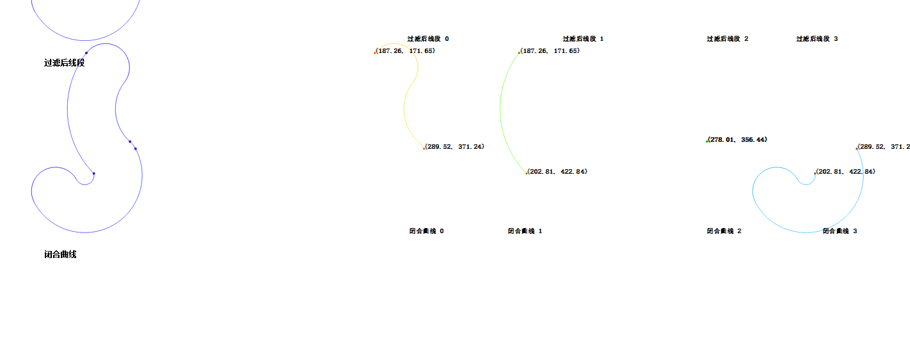

没有复现，可能是当时的精度问题，让端点没有被判断成同一个点


##### 单点太多

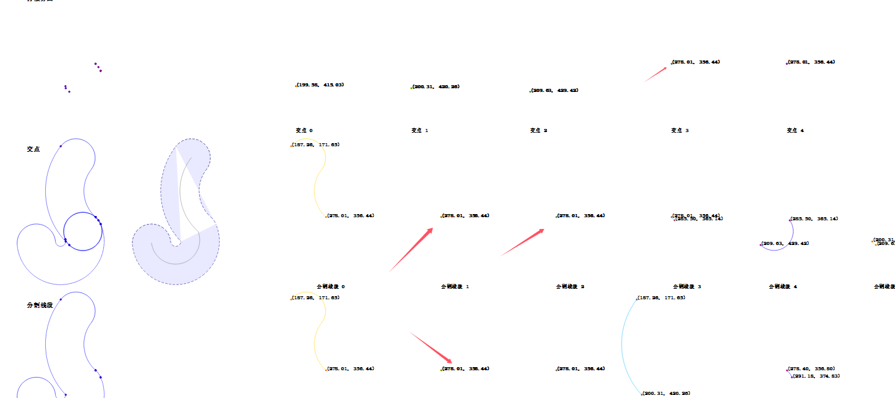

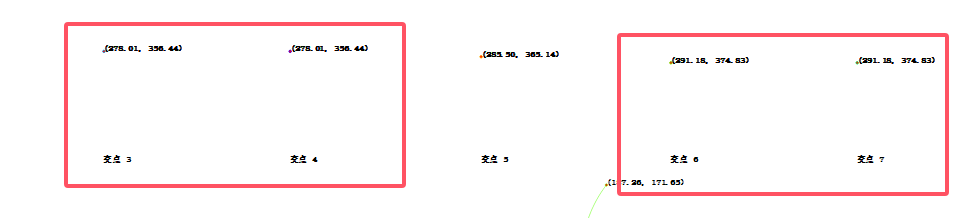

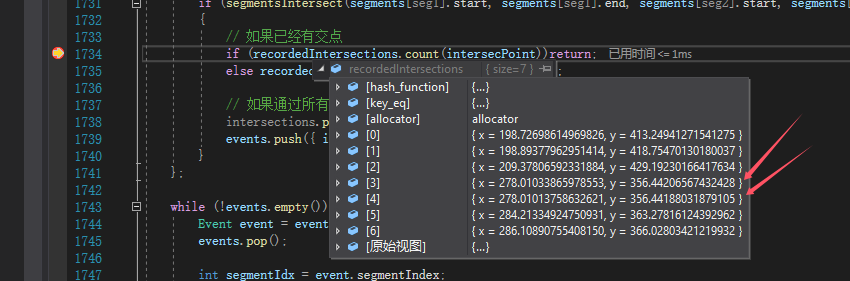

为什么有这么近的交点

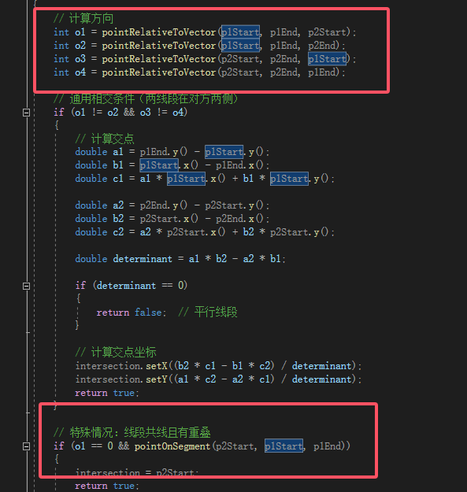

应该是float精度6~7位导致的


##### 缓冲区和控制点不同步

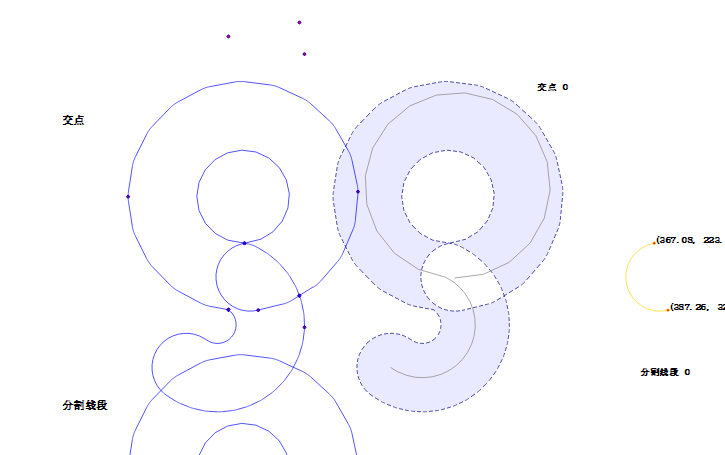

```cpp
    // 如果控制点发生变化或路径为空，则重新计算路径
    if (isControlPointsChanged())
    {
        resetControlPointsChanged(); // 重置控制点状态
        path = QPainterPath();       // 清空并重新生成路径

        if (calculateLinePoints(geoParameters.nodeLineStyle, controlPoints, points, geoParameters.steps))
        {
            if (!points.isEmpty())
            {
                path.moveTo(points.first());
                for (int i = 1; i < points.size(); ++i)
                {
                    path.lineTo(points[i]);
                }
            }
        }
    }

    // 如果状态完成且缓冲区可见，绘制缓冲区
    if (isStateComplete() && geoParameters.bufferVisible)
    {
        drawBuffer(painter);
    }

    // 如果被选中，绘制控制点
    if (isStateSelected())
    {
        drawControlPoints(painter);
    }

	// 。。。 画笔设置
    // 绘制路径
    painter.drawPath(path);
```

缓冲区应该在控制点计算出矢量图的之后再画。（再绘制线之前，不然会覆盖）


##### 少交点（还是有可能少）


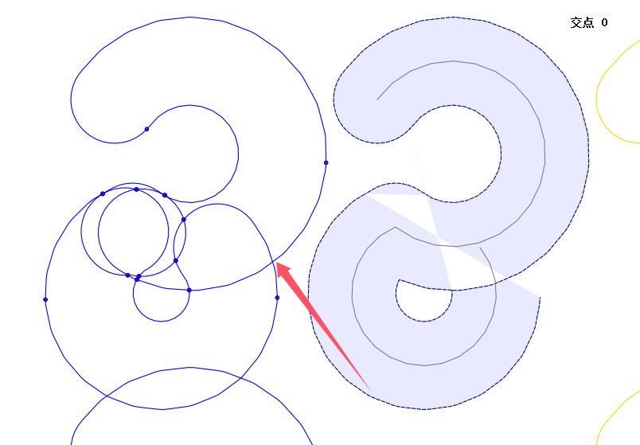

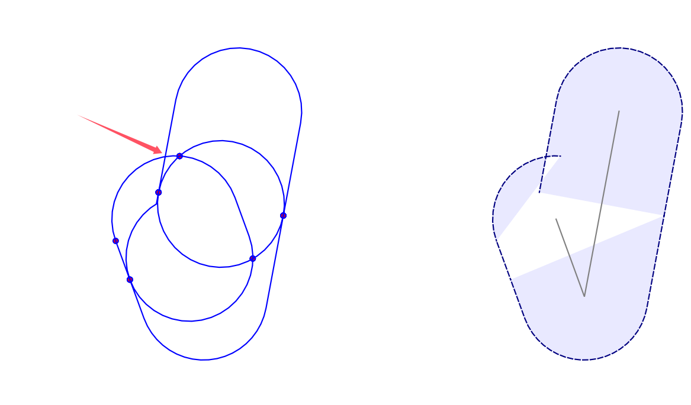

好像是这个的精度加到括号里了。

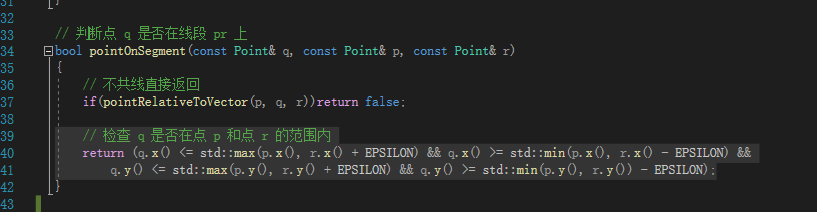

可惜不是。。。

简化成多边形研究：

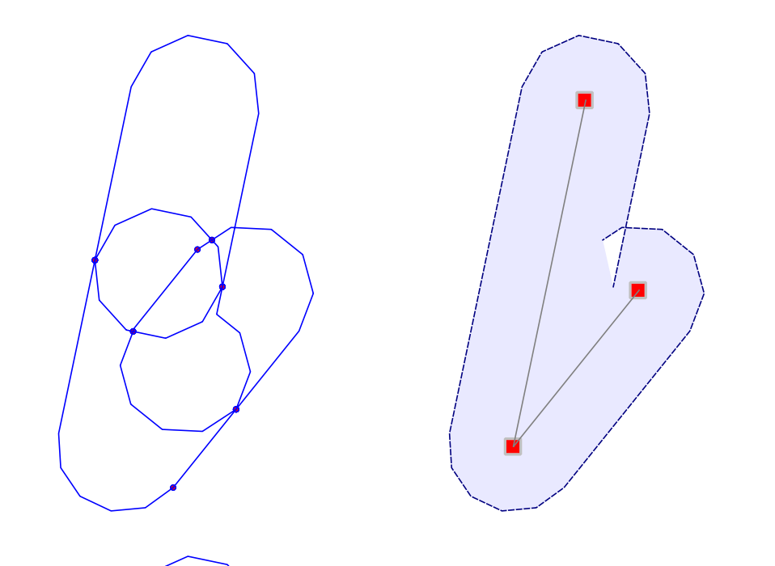


这水平段下标是1，另一段是39


插入1的时候他们应该相邻，但是没有

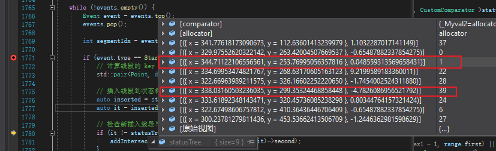

在1插入的时候他们应该结束了但是没有


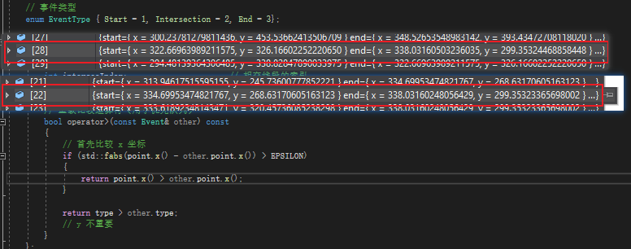

开始事件排在结束事件前导致的，我去。

逻辑上，尾端和首端相交的时候是要算一个交点（因为要用来切线）。

所以实际导致这个的是交点重复被忽略了，导致39号没有重新放进去。

但是又不能一直重复放（放进去就当交点事件处理，一直产生新的交点）

{

1.要么在处理交点的地方，把相交线段的新起点的x往右偏移，让他们不相交了。

2.要么判断是交点是终点的时候不插入新点。

}

考虑更普遍的情况：

1.多线交于一点，都要经过交点事件（同一个的交点的交点事件要处理），上下线的位置交换（重新插入）。

这样要允许同交点的事件，会照成起点的循环相交。

可能可以：**把交点事件分开成每条线的交点事件（即遇到交点重新插入以调整上下线关系）**。限制条件：单线单交点经过一次！

2.交点位于尾事件，怎么去掉这条线。 

————交点事件中判断交点在尾部的线丢弃。


坏，还是一样的

17段和8的尾相交，相交事件结束后重新插入起点时，8号还没结束事件，1号的隔壁还是8号

也没三线共交点，就是x == 17的起点处，y的排序没有排好，8号不应该干扰这里的排序。应该再增加一个优先级，交点后的起点，优先级在End后


出现的概率小了，但还是出现

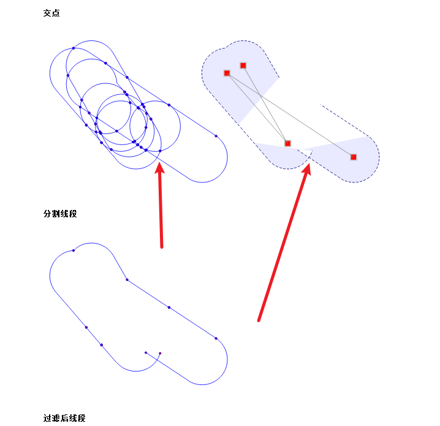


很多情况正常，但是会时常抽风。

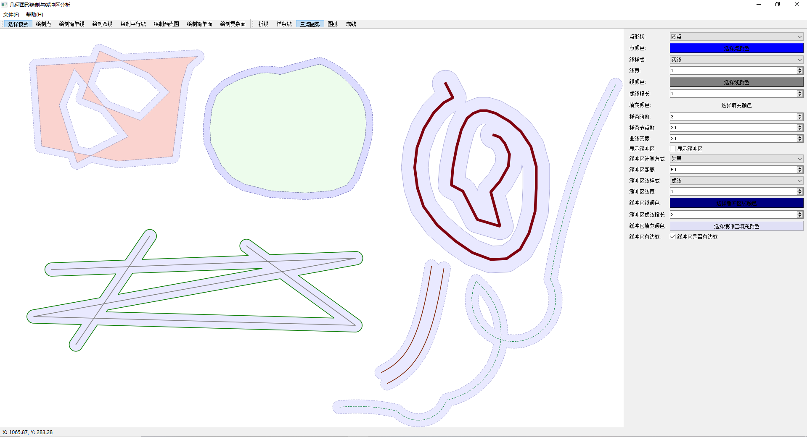
